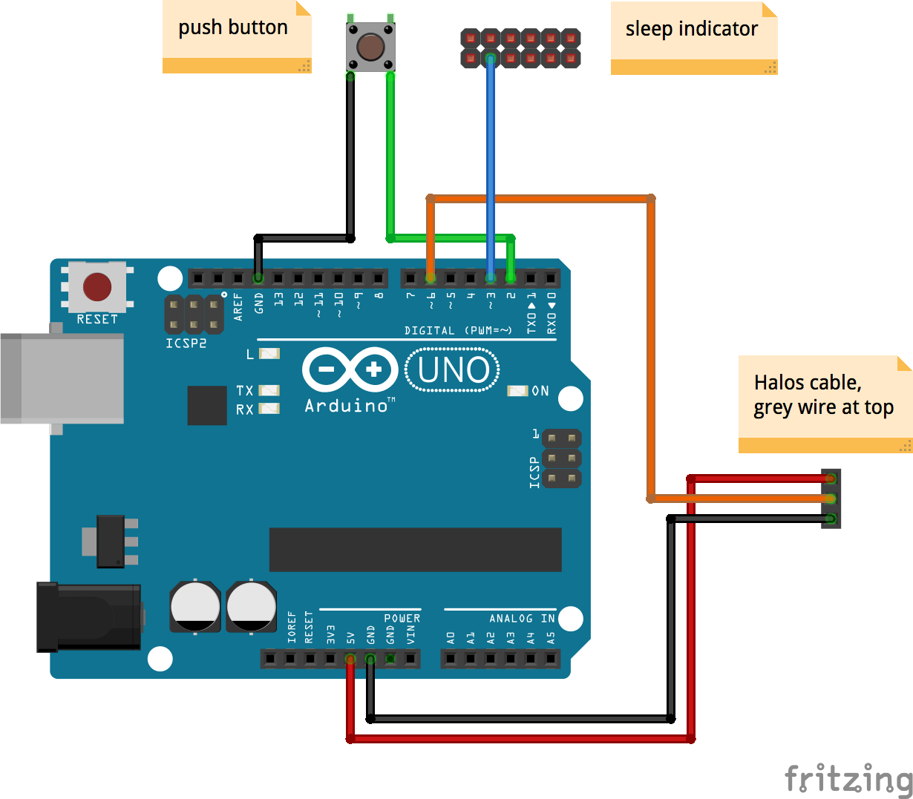

# Halos Controller

This program turns an Arduino in a controller for Phanteks [Halos Digital RGB Fan Frames](http://www.phanteks.com/HalosDigital.html). It comes with ten predefined patterns, and further patterns can be created in code with the help of a number of versatile primitives. When connected to a suitable source (see below), it renders a breathing pattern when the computer is asleep.

## Wiring

No warranties. The following diagram might be incorrect. I take no responsibility for any damanges caused by using the diagram and information below.

### Power

* internal USB2 header: pin 8 -> GND, pin 2 -> Vin
* alternatively connect the Arduino with a USB cable

An Arduino draws less than 50mA and a single Halos frame can draw up to about 380mA (measured with rainbow pattern). A USB port provides at least 500mA. So, running the controller and one frame on a single USB port is fine. 

Depending on the BIOS/UEFI settings the computer may even provide power to the USB ports when it's off. On my mainboard this happens when the ErP power saving mode is disabled.

### Halos frame

* grey wire from frame -> 5V
* black center wire from frame -> pin 6
* black outer wire from frame -> GND

### Controls

* push button (open / connect to GND) -> pin 2
* sleep indicator (open / connect to GND) -> pin 3

When connecting the sleep indicator pin to 5V from an internal HDD connector, e.g. molex, the pullup in the code should be removed, i.e. in that case in the `setup` function 

  pinMode(3, INPUT_PULLUP);

should be changed to 

  pinMode(3, INPUT);

## Required libraries

The following libraries must be installed in the Arduino library directory. They are not included in this git repository.

- Adafruit NeoPixel: https://github.com/adafruit/Adafruit_NeoPixel
- Timer One: https://code.google.com/archive/p/arduino-timerone

## Usage

* Upload sketch to Arduino.
* Press push button to cycle through patterns.
* Press push button and hold for more than 2s to turn LEDs on and off.
